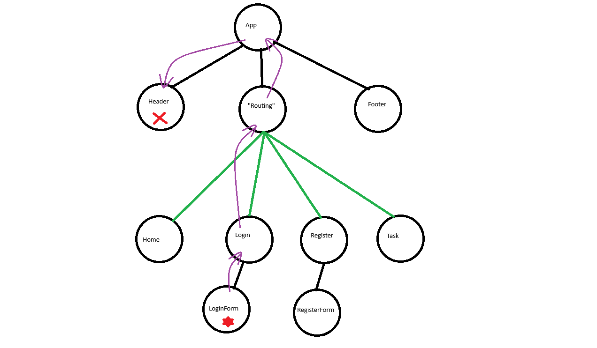

# Demo React - State management

## Problématique
Le partage d'information dans une application  
- Nécessite d'utiliser les props  
- Oblige les composants "principaux" à stocker les données via des states  

## Solution possible
Utiliser un mécanisme de gestion des données

### Sans bibliothèque
Utilisation du `Context`  
- Transmission d'information (state) dans l'arbre des composants

### Avec bibliothèque

### Store
Conteneur de données :  
- Les données sont accessibles en lecture  
- Notification en cas de changement de données  
- Méthode d'interaction  

Solutions possibles :  
- Flux.js (Déprécié)  
- Redux  
- Zustand  

### État partagé
En gros, c'est un state en dehors des composants React.  
Avantage : il est donc utilisable partout.  

Solutions possibles :  
- Recoil  
- Jotai ← _Utilisé pour la démo_

### Observables
Approche basée sur la réactivité.  
Observation d'un changement et réaction automatique.  

Solutions :  
- MobX

## Principe de la démo
Mise en place d'un compteur qui utilise Jotai.  
Pour la démo, celui-ci sera découpé en 3 composants :  
- DisplayCounter : Afficher la valeur du compteur  
- BtnIncrCounter : Bouton pour incrémenter et décrémenter le compteur  
- BtnResetCounter : Bouton pour reset le compteur  

### Mise en place
- Installer `Jotai` via `npm i jotai`  
- Créer des atoms  
- Utiliser l'atom via les hooks et ses méthodes
